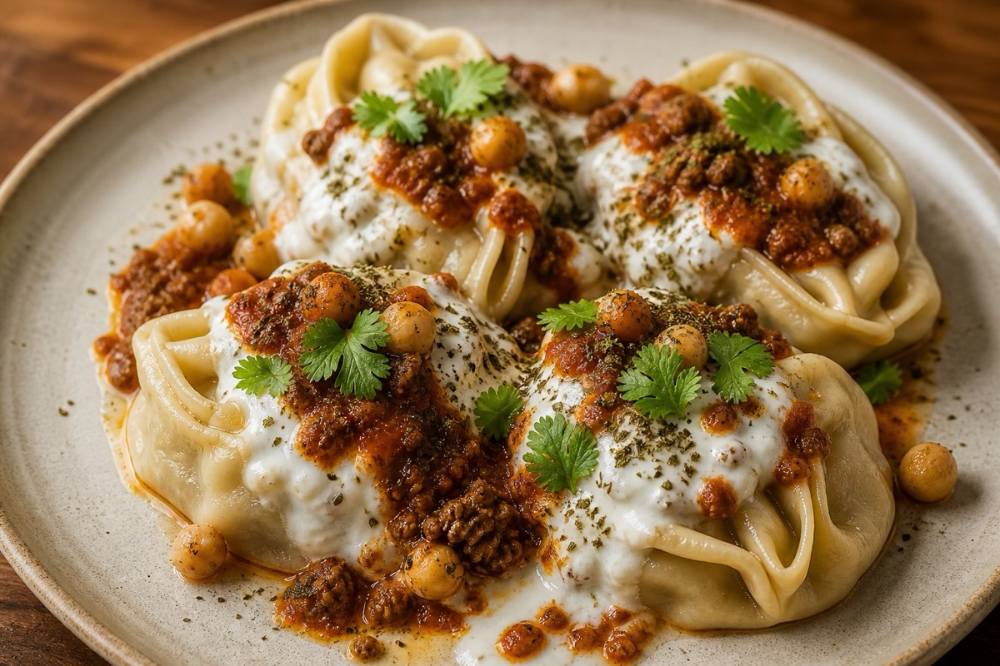

# Degi Kitchen Website Editing Guide

This is a static website. You do not need a special website builder to edit it.
You can edit it in Visual Studio Code, preview it in your browser, and then upload
the whole folder to your hosting service.

## Files To Know

- `index.html` - the website words, sections, menu items, phone number, footer, and social placeholders.
- `styles.css` - colors, spacing, fonts, mobile layout, and overall design.
- `script.js` - mobile menu behavior and the text-message request button.
- `assets/` - food photos used on the website.
- `favicon.svg` - the small browser tab icon.

## Open In VS Code

Open the folder:

```bash
open -a "Visual Studio Code" /Users/sulaimanassadullah/Documents/Catering
```

The `code` command may not work on your computer yet. To enable it:

1. Open VS Code.
2. Press `Command + Shift + P`.
3. Search for `Shell Command`.
4. Choose `Install 'code' command in PATH`.

After that, this will work too:

```bash
code /Users/sulaimanassadullah/Documents/Catering
```

## Preview Changes

Simple preview:

1. Open `index.html` in your browser.
2. Refresh the browser after saving changes.

Better preview:

```bash
cd /Users/sulaimanassadullah/Documents/Catering
npm start
```

Then open:

```text
http://127.0.0.1:5173
```

Stop the preview server with `Control + C` in Terminal.

## Common Edits

### Change The Phone Number

In `index.html`, search for:

```text
573-639-5967
```

Also search for the phone link format:

```text
+15736395967
```

The phone number is currently only used in `index.html`.

### Change The Order Email

In `index.html` and `script.js`, search for:

```text
order@degikitchen.com
```

Replace each match with the new order email address.

### Add Social Media Links

In `index.html`, search for:

```text
Add future social links here
```

Replace the example links with your real Instagram, Facebook, or TikTok links.

### Change Menu Items

In `index.html`, search for:

```text
menu-category
```

Each category has individual menu cards. You can edit dish names, descriptions,
category labels, and image file names there.

### Replace Food Photos

1. Add the new photo to the `assets/menu/` folder.
2. In `index.html`, change the matching image path, for example:

```html

```

Keep image names simple, like:

```text
new-mantoo-photo.jpg
```

### Change Colors

In `styles.css`, the main colors are at the top:

```css
:root {
  --ink: #17130f;
  --coal: #0f0d0b;
  --cream: #f7f1e8;
  --saffron: #c4882c;
}
```

Change those values carefully, then preview the site on desktop and phone size.

## Publishing Updates

If you publish with Netlify drag-and-drop, upload the whole folder again after edits:

```text
/Users/sulaimanassadullah/Documents/Catering
```

Do not upload only `index.html`, because the website also needs `styles.css`,
`script.js`, `favicon.svg`, and the `assets/` folder.

For easier long-term updates, connect the project to GitHub and deploy from Netlify
or Vercel. Then every saved change you push to GitHub can update the live website.
