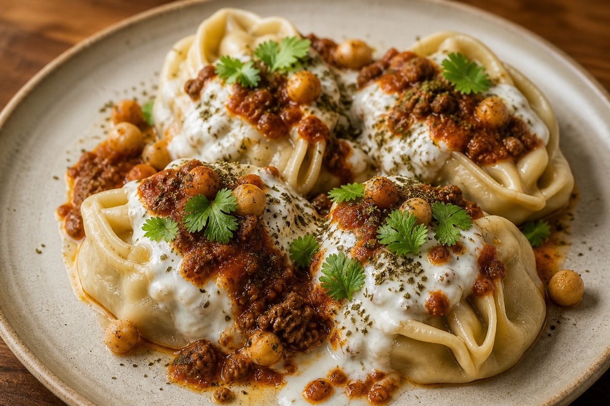

# Degi Kitchen Website Editing Guide

This is a static website. You do not need a special website builder to edit it.
You can edit it in Visual Studio Code, preview it in your browser, and then upload
the whole folder to your hosting service.

## Files To Know

- `index.html` - the website words, sections, menu items, phone number, footer, and social placeholders.
- `styles.css` - colors, spacing, fonts, mobile layout, and overall design.
- `script.js` - mobile navigation, menu categories, dish selection, and prepared email/text inquiries.
- `assets/editorial/` - current illustrative food imagery, source notes, and generation prompts.
- `assets/fonts/` and `assets/icons/` - self-hosted fonts and Lucide icons, including their licenses.
- `favicon.svg` - the small browser tab icon.

## September 2026 Redesign

The site uses a modern Afghan palette of deep green, white, charcoal, and restrained red.
All 30 dishes remain in the HTML. JavaScript adds category tabs and a selection list;
without JavaScript, the complete menu remains available.

The inquiry form submits to Netlify Forms (`degi-inquiry`). Configure its email
notification to the owner's personal inbox in Netlify; the recipient isn't public
in the HTML. Submissions are also retained in the site's Forms dashboard. The
`order@degikitchen.com` link remains for direct email, with current DNS forwarding
to the owner's Gmail. Gmail can hide duplicate self-sent forwarding tests.
Email draft, text-message, and copy options remain as fallbacks.
Phone and text links use separate actions. No payment is collected on the site.

Food imagery combines licensed free kabab photography and disclosed generated images.
Original generated PNGs remain in the owner's Codex folder; optimized files are served from this project.
See `assets/editorial/README.md` for source details and design references.

## Order Assistant

The bottom-right assistant uses a Netlify Function and GPT-4.1 mini through the host's
AI Gateway. Netlify injects server-side credentials on eligible credit-based plans.
No API keys appear in public files. It uses the existing hosting credits; billing,
automatic recharge, and paid subscriptions have not been enabled or changed.

The build extracts all menu names and descriptions from `index.html` for the assistant.
The assistant suggests dishes but only a visitor's explicit add action selects one.
Review inquiry copies stated date, guest count, and city into empty form fields and
does not replace existing notes or submit anything. The visitor must press Send Inquiry.
Pricing, availability, allergens,
and arrangements require human confirmation. Chat is held in browser memory only,
not local storage; messages are processed by OpenAI via Netlify, disclosed in the widget.
No visitor chat content is written to application logs. Provider retention policies
still apply. A timeout or AI outage leaves the normal inquiry/call/text paths available.

Requests are limited to 10 per minute per IP/domain by Netlify. History, message size,
output tokens, and calls per browser conversation are bounded. This is not a global
spending cap; monitor hosting credits in Netlify. `OPENAI_API_KEY` / `OPENAI_BASE_URL`
may be supplied server-side if the host's gateway is unavailable. Never put keys here.

Run `npm test` for validation and safety checks, and `npm run build` for a clean public
`dist/` directory. Netlify uses `netlify.toml` to deploy that directory and the function.
Private outputs, working files, and function source are not part of the public build.

## Open In VS Code

Open the folder:

```bash
open -a "Visual Studio Code" /Users/sulaimanassadullah/Documents/Catering
```

The `code` command may not work on your computer yet. To enable it:

1. Open VS Code.
2. Press `Command + Shift + P`.
3. Search for `Shell Command`.
4. Choose `Install 'code' command in PATH`.

After that, this will work too:

```bash
code /Users/sulaimanassadullah/Documents/Catering
```

## Preview Changes

Simple preview:

1. Open `index.html` in your browser.
2. Refresh the browser after saving changes.

Better preview:

```bash
cd /Users/sulaimanassadullah/Documents/Catering
npm start
```

Then open:

```text
http://127.0.0.1:5173
```

Stop the preview server with `Control + C` in Terminal.

## Common Edits

### Change The Phone Number

In `index.html`, search for:

```text
573-639-5967
```

Also search for the phone link format:

```text
+15736395967
```

The phone number is currently only used in `index.html`.

### Change The Order Email

In `index.html` and `script.js`, search for:

```text
order@degikitchen.com
```

Replace each match with the new order email address.

### Add Social Media Links

In `index.html`, search for:

```text
Add future social links here
```

Replace the example links with your real Instagram, Facebook, or TikTok links.

### Change Menu Items

In `index.html`, search for:

```text
menu-category
```

Each category has individual menu cards. You can edit dish names, descriptions,
category labels, and image file names there.

### Replace Food Photos

1. Add the new photo to the `assets/menu/` folder.
2. In `index.html`, change the matching image path, for example:

```html

```

Keep image names simple, like:

```text
new-mantoo-photo.jpg
```

### Change Colors

In `styles.css`, the main colors are at the top:

```css
:root {
  --ink: #17130f;
  --coal: #0f0d0b;
  --cream: #f7f1e8;
  --saffron: #c4882c;
}
```

Change those values carefully, then preview the site on desktop and phone size.

## Publishing Updates

If you publish with Netlify drag-and-drop, upload the whole folder again after edits:

```text
/Users/sulaimanassadullah/Documents/Catering
```

Do not upload only `index.html`, because the website also needs `styles.css`,
`script.js`, `favicon.svg`, and the `assets/` folder.

For easier long-term updates, connect the project to GitHub and deploy from Netlify
or Vercel. Then every saved change you push to GitHub can update the live website.
